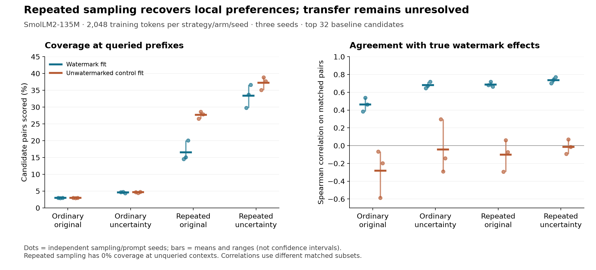

# Repeated-prefix estimation experiment

This controlled local experiment tests whether concentrating samples on exact
prefixes improves recovery of watermark preferences at those prefixes. It also
measures the cost to coverage at unqueried contexts. This is a stronger access
setting than a text-only commercial API: the collector can reset watermark
history and condition on exact generated prefixes. Estimators receive only
sampled token IDs, never keys or model probabilities.

The public protocol was committed before collection. Both strategies receive
2,048 training tokens per arm and seed. Repeated sampling draws 64 independent
next tokens at each of 32 prefixes. Passive sampling draws a 64-token continuation
at each of those same prefixes. Three independent sampling/prompt seeds share
one fixed model and public watermark key. An unwatermarked control fit measures
spurious estimated watermark signal.

The new estimator keeps both positive and negative log-ratio estimates and
requires the context in both training corpora. It uses symmetric add-0.5
smoothing on the observed per-context union, a delta-method log-ratio variance,
and score = log-ratio / (1 + variance). The uncertainty is approximate, especially
at low counts. Shrinkage is a ranking heuristic, not a posterior probability or
certified confidence interval. Missing context or token remains unknown.

Evaluation uses the exact watermarked/unwatermarked log probability ratio on
the top 32 baseline next-token candidates. Scores at queried anchors measure
local recovery, not generalization. Results at 32 unqueried contexts are separate.
Candidate coverage and conditional ranking/sign accuracy must be read together.
The known-key oracle is used only after fitting; no detector FPR is claimed.
The previous document detector's calibration limitation remains unresolved.

HF SynthID initializes an empty context instead of reading the whole prompt.
The collector replays four skipped processor calls before sampling to load the
actual four-token suffix. A CPU/CUDA test compares its resulting distribution
against g-values computed directly for every candidate and checks repeat masking.
Special tokens are excluded before watermarking; all remaining vocabulary tokens
are sampled at temperature 1 without top-k/top-p truncation. Fixed-length
continuations provide equal generated-token budgets. Discovery (1,536 additional
unwatermarked tokens per seed) is shared and accounted separately. Query latency
and total inference work are not equal across strategies.

Run from the repository root with the optional evaluation dependencies:

```sh
python stealer/prefix_experiment.py --protocol benchmarks/stealer-prefix/protocol.json --out work/prefix-experiment --device cuda
python stealer/prefix_experiment.py --out work/prefix-experiment --score-only
```

Repeating collection with the same command reuses completed per-seed artifacts.
Source, protocol, device and runtime changes are rejected. Interruption within a
seed recomputes that entire seed. Score-only needs only Python's standard library
and records its analysis source hash. Raw experiment artifacts contain public
synthetic prompts and generated local-model data; no private Claude logs are used.

## Completed results

The Spark job completed all three seeds in 95.2 seconds with exit code zero.
Generation revision was `0d29a96`. Total sampled tokens: 36,864 for training plus
4,608 for shared discovery. Source and artifact hashes were verified; stdlib-only
rescoring reproduced every Spark metric exactly. Equal token budgets and unique
anchor/novel contexts were also checked per seed.

| Collection | Estimator | Anchor candidate coverage | Pooled matched-pair Spearman | Conditional sign accuracy |
| --- | --- | ---: | ---: | ---: |
| Ordinary | Original | 2.99% | 0.462 | 64.1% |
| Ordinary | Uncertainty | 4.62% | 0.680 | 72.7% |
| Repeated prefix | Original | 16.57% | 0.688 | 80.8% |
| Repeated prefix | Uncertainty | 33.37% | 0.737 | 88.7% |

Means are across three prompt/sampling seeds with one fixed model/key. Sign
accuracy is conditional on matched candidates with absolute oracle log-ratio
at least 0.2; rankings use each estimator's own matched subset. Repeated-prefix
uncertainty coverage ranges from 29.79% to 36.62%, and sign accuracy from 87.43%
to 89.49%. Ranges are not confidence intervals. Its matched candidates cover
94.83% of baseline mass within the top 32 candidates, not the entire vocabulary.

Mean within-context rank correlation is 0.656 for repeated-prefix uncertainty
and 0.619 for repeated-prefix original. The uncertainty control fit has pooled
correlation -0.013 and within-context correlation -0.043. Ordinary collection
usually has too few alternative observations for within-context ranking.

**Repeated-prefix coverage at novel contexts is zero in every seed.** Passive
coverage is about 0.1% or less. This demonstrates local preference recovery;
it does not establish a general-purpose stolen watermark, document detector,
or successful removal.



[Aggregate results](results.summary.json) retain means, ranges, and valid seed
counts. [Post-hoc diagnostics](posthoc-diagnostics.json) separately check sign
imbalance and equal candidate subsets. Repeated-prefix uncertainty balanced sign
accuracy is 87.7%, while always predicting its majority sign yields 69.1%
ordinary accuracy. On identical matched candidate subsets, uncertainty improves
repeated-prefix pooled rank correlation in all three seeds. These extra checks
were not predeclared and do not isolate shrinkage from the other estimator changes.

An exploratory reanalysis of the earlier Dolly corpus improves conditional
AUROC from 0.587 to 0.688. On identical scorable documents it improves from
0.618 to 0.717 (98 watermarked, 61 baseline). However, the new estimator's
conditional false-positive rates are 13.6% (11/81) on baseline and 5.9% (6/102)
on independent controls. Its watermarked pair coverage is only 4.45%, with
143/256 watermarked documents abstaining. It is not a validated 5%-FPR detector.

Validation: full local suite 1,251 passed / 18 optional skips; focused Spark
suite 38 passed. All research data here are public local-model generations;
no private Claude logs or lyrics are included. A Fable songwriting session was
inventoried separately, but no unsupported cross-tokenizer watermark score or
commercial-watermark recovery claim was produced.
