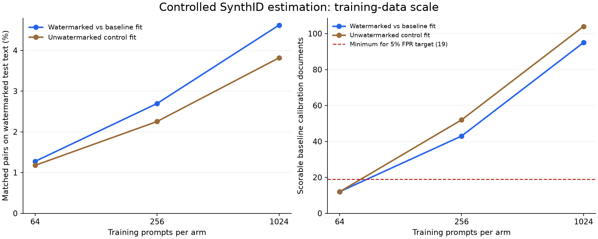

# DGX Spark scaling experiment

[Protocol](protocol.json) was committed before collecting or inspecting the
held-out results. It fixes one local model and compares nested training budgets
of 64, 256, and 1,024 prompts per arm on a new, deduplicated Dolly corpus.
Calibration and evaluation each use 256 prompts; all three arms generate at
most 128 tokens per response. This is 4,608 responses in total.

The model is still SmolLM2-135M-Instruct. The goal is to isolate data-volume
effects within a run before adding larger-model and cross-model confounders.
This remains a local SynthID experiment with known experimental keys, not a
vendor detector. Source and prompt provenance are in the protocol and runtime
artifacts. Prompt data retain their CC BY-SA 3.0 attribution.

## Operational validation

- Full local suite: 1,245 passed; 16 optional skips.
- Focused Spark suite: 30 passed, including real CPU/CUDA positive controls.
- A real-model run was deliberately interrupted immediately after the first
  batch was committed. Resuming and running an independent uninterrupted copy
  produced exactly the same corpus SHA-256:
  `cb808c57869e9c67737a19b95a5414f4ccf4b744d70b6a98754ad13aee680606`.
- The resumed corpus was also scored through the separate offline scoring path.

See [the longer-run workflow](../../docs/stealer-evaluation.md#longer-runs-and-dgx-spark)
for setup, collection, resumption, and scoring. The generation runtime uses the
Spark's CUDA-enabled ARM64 PyTorch, with Transformers 4.57.6 in an isolated
project environment. It does not replace the host or container's shared runtime.

## Completed results

The Spark collected all **4,608 responses** in **562.8 seconds** (9.4 minutes),
then scored the corpus in 2.9 seconds. Source revision was
`66a613b9438985aca0fe88d81381904edc50629e`, with a clean working tree.
The corpus and source hashes were verified after retrieval.

**More data improved coverage and made calibration possible, but the estimator
remains weak as a detector in this experiment.** The table below describes the
watermarked-versus-baseline estimator. Every test arm contains 256 documents;
fractions use only documents on which the detector could make a decision.
Abstentions are not negative detections.

| Training prompts/arm | Watermarked pair coverage | Scorable calibration negatives | Watermarked flagged/decisions | Watermarked abstentions | Baseline false positives/decisions | Control false positives/decisions |
| --- | ---: | ---: | --- | ---: | --- | --- |
| 64 | 1.28% | 12/256 | no calibrated decisions | 256 | no calibrated decisions | no calibrated decisions |
| 256 | 2.70% | 43/256 | 7/65 | 191 | 5/28 | 5/40 |
| 1,024 | 4.62% | 95/256 | 14/117 | 139 | 1/72 | 3/90 |

At 1,024 training prompts, 14/117 scorable watermarked documents were flagged
(12.0%; Wilson 95% CI 7.3-19.1%). Across all 256 watermarked documents that is
14 flagged (5.5%), with 139 abstentions. The baseline false-positive rate was
1/72 (1.4%; CI 0.2-7.5%), and the independent control rate was 3/90 (3.3%;
CI 1.1-9.3%). Scorable AUROC was 0.587. Thus better coverage does not yet imply
useful population-level detection.

The score/g-value Spearman correlation at that budget was 0.190 on 1,848 unique
matched held-out pairs, versus 0.009 for the unwatermarked-control fit. This is
an exploratory association on selected pairs, not a validated estimate of the
entire watermark rule. The control-trained estimator also gains coverage as
its corpus grows; raw coverage growth by itself is not watermark recovery.

### The reference detector's calibration limitation

The keyed reference clearly separated watermarked and unwatermarked text:
AUROC **0.9979**, with 253/255 scorable watermarked responses detected (99.2%)
and one abstention. However, its held-out false-positive rates were **23/255
(9.0%; CI 6.1-13.2%)** on baseline text and **29/256 (11.3%; CI 8.0-15.8%)**
on the independent control. Both exceeded the requested 5% target.

Its predeclared signal sanity check passed, but that check does not certify
false-positive control. This run must not be presented as a detector operating
at a verified 5% false-positive rate. The learned 256-prompt estimator also
exceeded that target on its small scorable subsets. Additional independent
seeds and fresh calibration/evaluation splits are needed; any length-aware
calibration change should be evaluated on new held-out data rather than tuned
against these results.

### Implication for the next stage

The resumable collection and analysis infrastructure works, and the study now
measures how a larger corpus changes coverage. The remaining research problem
is sample-efficient estimation and reliable calibration. Scorer-assisted
removal remains untested because this run does not establish sufficiently
useful held-out detection. No vendor-watermark or successful-removal claim is
supported. One seed, one small model, normalized rather than semantic
deduplication, and conditional metrics limit generalization.

[Aggregate results](results.summary.json) retain every arm, threshold, count,
interval, correlation, and provenance hash. Reproduction instructions are in
[the experiment documentation](../../docs/stealer-evaluation.md#longer-runs-and-dgx-spark).
